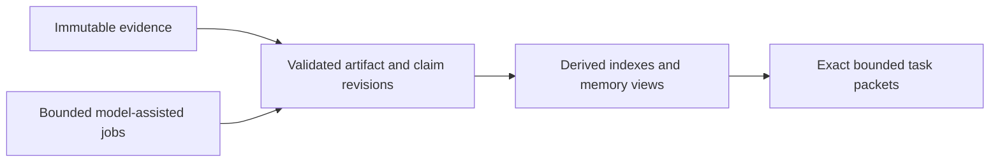

# CBR

Independent evidence-backed memory and context for agentic work.

> Bootstrap documentation only. No product runtime, released API, installation command or performance claim is established here. The reviewed architecture is `architecture-v1-20260912`, published as `public-development-v1-20260913`. Canonical specifications are available through [the documentation map](docs/README.md). This README is an overview, not the full specification.

CBR helps agents preserve constraints, reuse useful investigations and recover context across long projects. It can run directly with model providers and evidence producers, without PIO or Combraton. Its models remain fallible; memory must preserve provenance and uncertainty rather than turn summaries into authority.

## Responsibilities

- Capture evidence with source, time, code/environment and access scope.
- Maintain small versioned memory artifacts, claims, support and conflicting interpretations.
- Run bounded maintenance and request-time investigation procedures with durable progress outside model context.
- Build task-specific packets with exact bytes, citations, applicability, required items and explicit gaps.
- Support correction, retained history, dependency-aware invalidation, export and scoped retention.

Background consolidation is bounded maintenance, not a permanently thinking model. Greenfield capture starts early; brownfield assimilation is progressive and task-directed, with no default whole-repository startup barrier. Binding corrections remain accessible before explanatory consolidation completes.

Every model call and aggregate tool batch has limits. Large results use bounded projections and retained evidence handles. Direct calls plus a small investigative loop are the initial direction; million-token windows, a trained memory model, recursive swarms and a full coding-agent SDK are not prerequisites.

## Independence and protocol

Implement the relevant [protocol](https://github.com/Combraton/protocol) Core/Evidence/Knowledge/Context profiles. A standalone caller defines authority and scope. Under full composition, [Combraton](https://github.com/Combraton/combraton) owns project direction, readiness and acceptance; CBR cannot adopt new direction or stop project execution from a model-derived finding.

The caller selects advisory, required-before-start or required-before-transition context obligations. CBR returns available material and missing items. Deadline expiry does not supply proof or consent; packet delivery is not comprehension. Versioned updates preserve earlier packets and actual delivery observations.

[PIO](https://github.com/Combraton/pio) is an optional provider for existing-harness investigations, with a separate identity/grant. Direct model calls remain independent. Preparation must not deadlock on a slot held by its waiting consumer.

## First milestone

Build evidence sealing, a validated revision path, transparent retrieval/applicability and exact packet delivery, then include bounded model-assisted investigation in the first credible memory milestone. Demonstrate a small code-flow finding, a fresh continuation, correction during preparation and changed-source invalidation. A lexical-only store is an intermediate step, not completion of this product.

Measure downstream accepted outcomes, missed constraints, unsupported claims, context timing, human reconstruction and total cost including cold initialization/background work.

## Stack and status

Rust/SQLite are core starting preferences. Native provider calls versus lightweight Pi-derived libraries need a bounded runtime comparison. Prime and upstream Pi are different source/release candidates; neither is selected. Generated-program workers are optional and require real scope enforcement, host-owned provenance and aggregate limits.

For development milestones, read [BOOTSTRAP](https://github.com/Combraton/combraton/blob/main/BOOTSTRAP.md). No runtime, benchmark claim or license is provided by this bootstrap; the repository is public and its project license remains to be selected.

## Working on this repository

Read [AGENTS.md](AGENTS.md), [CLAUDE.md](CLAUDE.md), [the documentation map](docs/README.md), and [verification](docs/VERIFICATION.md). Use existing native harnesses for development. **Combraton self-development is deferred until usable v0.1 releases of all four projects.** Public visibility does not select a license; no project license has been added yet.
