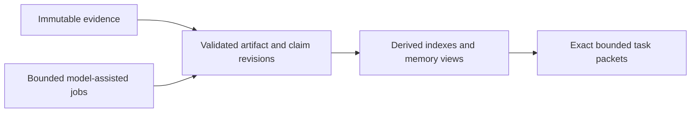

# CBR

Independent evidence-backed memory and context for agentic work.

> **Status, 2026-09-17: milestone M1 of standalone v0.1 is complete and M2, Knowledge, is in review. Nothing is released.** CBR is a working protocol provider for evidence and for scoped, challengeable claims. It has no packets, retrieval or model calls yet. The reviewed architecture is `architecture-v1-20260912`, published as `public-development-v1-20260913`. Canonical specifications are available through [the documentation map](docs/README.md). This README is an overview, not the full specification.

## What exists now

Built from source with `cargo build --workspace --locked`. There is no release, no packaged binary and no installation command.

- **`cbr-provider`**, a provider of [Combraton Protocol v0.1.0](https://github.com/Combraton/protocol) serving `core/1`, `evidence/1` and `knowledge/1` over the stream binding, on **stdio and on a Unix socket**. The socket form checks the peer's operating-system user and requires `core.authenticate` with a credential the provider issues, rotates and revokes. Storage is SQLite (WAL, `synchronous=FULL`) plus a content-addressed object store that verifies every object from disk.
- **Conformance, measured against the pinned release's own fixtures** and gated in CI on Linux and macOS: `stream` 24 of 24; `core` 130 of 135; `socket` 11 of 13; `evidence` 16 of 16; `knowledge` 10 of 10; all 31 encoding vectors. The 7 fixtures CBR does not pass declare the `execution` profile, which CBR never serves, so they are permanently out of reach. `core.effects` and `core.events.backpressure` are implemented and rest on CBR's own tests alone.
- **`cbr ingest` and `cbr fetch`**, a separate command that uses only the public socket. Fetch checks the bytes against the sealed digest before writing them.
- **Knowledge through `cbr`**: `propose`, `revise`, `decide`, `evaluate`, `inspect`, `history` and `authority bind`. Only the scope's bound authority records reliance, never a grant or a derivation label, and claim revisions are immutable in the database.
- **Source identity**: git root trees, dirty-snapshot digests and a declared environment fact set that includes build facts, each with a negative control.
- **A storage crash matrix.** The provider is killed with `SIGKILL` at each commit boundary that exists today, then restarted to check what survived.

What **does not** exist: packets or Context, retrieval or indexes, any model call, background maintenance, and any journey run except J9, which needs no model. [VERIFICATION](docs/VERIFICATION.md) has every command and what each one does not establish. The [M1 close-out](docs/work/m1/CLOSEOUT.md) has the outcome table, the coverage limits and every mutant.

```sh
cargo build --workspace --locked
mkdir -m 700 run    # the socket directory must be private, and its path short
echo '{"format":"cbr-config/1","principal":"owner"}' > cbr.json

# Terminal 1: serves until its standard input closes (Ctrl-D). On first start
# it issues a credential to data/credentials/owner (mode 0600).
target/debug/cbr-provider --data-dir data --config cbr.json --socket run/cbr.sock

# Terminal 2: ingest prints the artifact id and sealed digest that fetch needs.
target/debug/cbr ingest notes.txt --socket run/cbr.sock --credential-file data/credentials/owner
target/debug/cbr fetch <artifact> --digest <digest> --out copy.txt --socket run/cbr.sock --credential-file data/credentials/owner
```

CBR helps agents preserve constraints, reuse useful investigations and recover context across long projects. It can run directly with model providers and evidence producers, without PIO or Combraton. Its models remain fallible; memory must preserve provenance and uncertainty rather than turn summaries into authority.



## Responsibilities

- Capture evidence with source, time, code/environment and access scope.
- Maintain small versioned memory artifacts, claims, support and conflicting interpretations.
- Run bounded maintenance and request-time investigation procedures with durable progress outside model context.
- Build task-specific packets with exact bytes, citations, applicability, required items and explicit gaps.
- Support correction, retained history, dependency-aware invalidation, export and scoped retention.

Background consolidation is bounded maintenance, not a permanently thinking model. Greenfield capture starts early; brownfield assimilation is progressive and task-directed, with no default whole-repository startup barrier. Binding corrections remain accessible before explanatory consolidation completes.

Every model call and aggregate tool batch has limits. Large results use bounded projections and retained evidence handles. Direct calls plus a small investigative loop are the initial direction; million-token windows, a trained memory model, recursive swarms and a full coding-agent SDK are not prerequisites.

## Independence and protocol

Implement the relevant [protocol](https://github.com/Combraton/protocol) Core/Evidence/Knowledge/Context profiles. A standalone caller defines authority and scope. Under full composition, [Combraton](https://github.com/Combraton/combraton) owns project direction, readiness and acceptance; CBR cannot adopt new direction or stop project execution from a model-derived finding.

The caller selects advisory, required-before-start or required-before-transition context obligations. CBR returns available material and missing items. Deadline expiry does not supply proof or consent; packet delivery is not comprehension. Versioned updates preserve earlier packets and actual delivery observations.

[PIO](https://github.com/Combraton/pio) is an optional provider for existing-harness investigations, with a separate identity/grant. Direct model calls remain independent. Preparation must not deadlock on a slot held by its waiting consumer.

## First milestone

Build evidence sealing, a validated revision path, transparent retrieval/applicability and exact packet delivery, then include bounded model-assisted investigation in the first credible memory milestone. Demonstrate a small code-flow finding, a fresh continuation, correction during preparation and changed-source invalidation. A lexical-only store is an intermediate step, not completion of this product.

Measure downstream accepted outcomes, missed constraints, unsupported claims, context timing, human reconstruction and total cost including cold initialization/background work.

## Stack and status

Rust and SQLite, as accepted in [ADR 001](docs/decisions/001-standalone-v0.1-scope-and-stack.md): synchronous threads with no async runtime, `rusqlite`, and a hand-written object store. For model calls, M4 will speak both provider wire dialects directly, with MiniMax as the provider; no model call exists yet. Generated-program workers are optional and require real scope enforcement, host-owned provenance and aggregate limits.

For development milestones, read [BOOTSTRAP](https://github.com/Combraton/combraton/blob/main/BOOTSTRAP.md). This repository is licensed under [MIT](LICENSE), matching Protocol. No benchmark or performance claim is established here, and nothing above is a release.

## Working on this repository

Read [AGENTS.md](AGENTS.md), [CLAUDE.md](CLAUDE.md), [the documentation map](docs/README.md), and [verification](docs/VERIFICATION.md). Use existing native harnesses for development. **Combraton self-development is deferred until usable v0.1 releases of all four projects.** The project is [MIT licensed](LICENSE).

## Standalone-first validation

Support PIO's standalone client as an optional context consumer using public profiles and explicit caller authority. Retain direct-provider/no-PIO operation; reciprocal harness investigations must not recurse through automatic enrichment or deadlock on the waiting consumer. See [release gates](https://github.com/Combraton/combraton/blob/main/docs/STANDALONE-RELEASES.md), [PIO client semantics](https://github.com/Combraton/pio/blob/main/docs/spec/STANDALONE-CLIENT.md) and [benchmarks](https://github.com/Combraton/benchmarks). PIO and CBR develop in parallel against the agreed Protocol release surface; accepted standalone releases precede thin Combraton implementation.
