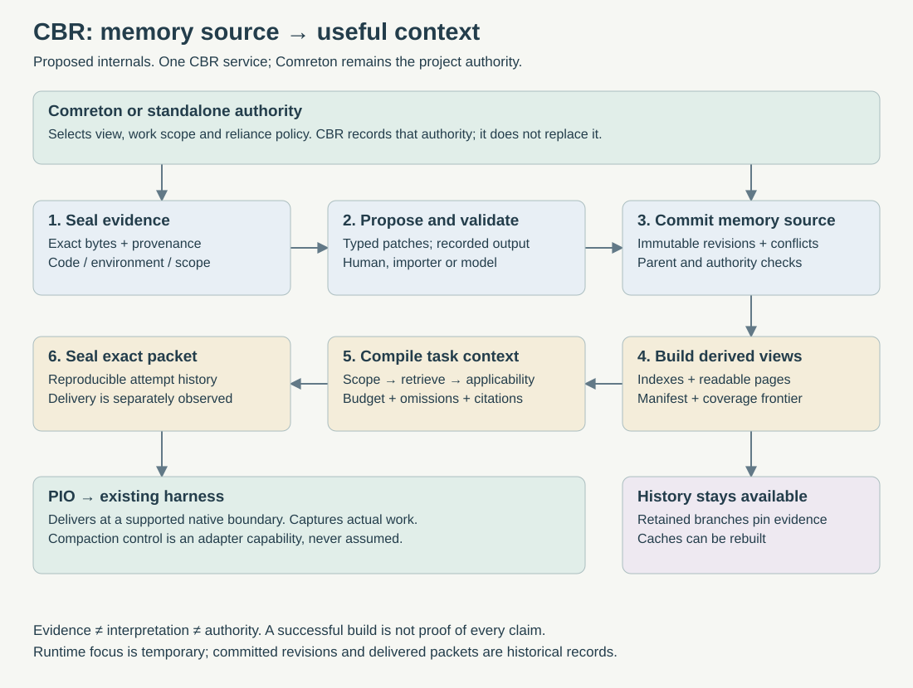

> Public edition `public-development-v1-20260913`. Adapted from the reviewed architecture baseline; names in the source may still say Comreton. See [publication and authority](https://github.com/Combraton/combraton/blob/main/docs/architecture/PUBLICATION.md). Development sequencing is governed by [DEVELOPMENT](https://github.com/Combraton/combraton/blob/main/docs/DEVELOPMENT.md); self-development is deferred until all four usable v0.1 releases.

# CBR internals: versioned memory and a context compiler

> Accepted internal design in [BASELINE](https://github.com/Combraton/combraton/blob/main/docs/architecture/BASELINE.md). Record names are conceptual until schema freeze. The September 9 assessment remains historical rationale.

**CBR should use the discipline of a codebase for memory: inspectable source, small revisions, explicit dependencies, derived builds, and reproducible delivery.** Its product is reliable continuity for work. Storing more memories is only useful if the next harness makes fewer mistakes.

The [September 12 memory engine](MEMORY-ENGINE.md) makes model-assisted maintenance and request-time investigation central. Its [bounded context/runtime design](MODEL-RUNTIME.md) specifies durable working state, bounded calls, checkpointing and SDK alternatives.

The [earlier memory architecture review (historical; not included)](https://github.com/Combraton/combraton/blob/main/docs/architecture/PUBLICATION.md#historical-material) explains which ideas survive. This design develops them within the existing CBR boundary. It does not introduce another project controller or require Git to be CBR's live database.



## 1. One authority for each kind of state

| Layer | Durable source | Derived or temporary | Rule |
|---|---|---|---|
| Evidence | Sealed payloads and capture descriptors | Search excerpts, previews | Preserve origin, scope, completeness, and exact revision anchors |
| Memory source | Assertion/entity revisions, proposed patches, actual transformation outputs, authority inputs and committed decisions | Current-state projections | A model proposal does not approve itself |
| Build | Build manifest with input frontier, versions and dependency identities | Lexical, identity, temporal, relationship and optional vector indexes; readable pages | Indexes can be replaced without changing meaning |
| Context runtime | Exact packets, selection trace, delivery references | Working set, ranking cache, focus state | Rebuilding a cache must not rewrite historical packets |

The initial physical layout remains **one CBR SQLite journal/metadata database plus immutable objects**, as specified in [STORAGE](https://github.com/Combraton/combraton/blob/main/docs/architecture/STORAGE.md). “Memory source tree” is a logical organization and export view. Markdown and JSON exports are editable proposals on import, not a second live authority. A graph database, vector database, per-build SQLite file, and Git repository are not four additional prerequisites.

Comreton owns which project view and reliance decisions govern an integrated work session. CBR owns the immutable knowledge and evidence represented by that view. Standalone CBR binds a local authority using the same distinction. Two authorities cannot both accept claims for the same bound scope.

## 2. The records that make memory inspectable

An **assertion revision** binds a subject, predicate or prose statement, scope, source support, semantic kind and target basis. Keep normative intent, observed behavior and interpretation distinguishable. “The service must use queue v2” and “the service currently uses queue v1” are drift, not a contradiction to erase.

An **entity revision** preserves a stable scoped identity, aliases and resolution evidence. Renames, splits and merges produce explicit lineage. A matching name or embedding is a candidate match; it cannot silently merge two customers, repositories, symbols or environments. Code symbols have revision anchors, and ambiguous resolution remains ambiguous.

A **memory patch** names its base view, touched record revisions, proposed operations, evidence and producer. Operations create, revise, link, supersede or record evaluations; they do not execute arbitrary scripts. Rejection remains inspectable. “Mark stale” is an applicability evaluation tied to a target basis, not an overloaded truth flag.

A **derivation record** captures exact model inputs, actual outputs, model/configuration identity, and validation outcome. Replay consumes the recorded output. Running the model again creates a new derivation; even the same prompt and model version cannot promise identical output.

A **build manifest** names the selected source frontier, schema/compiler versions and included dependencies. It distinguishes complete, lagging and unavailable projections. A derived embedding model upgrade creates a new index version, not new historical facts.

Separate three coordinates: when an event happened or a claim was valid, when CBR learned it, and which code/environment revision it concerns. Unknown event time remains unknown. A single timestamp cannot answer both “what did we believe then?” and “what do we now know about then?”

## 3. Write path: capture first, interpret selectively

1. Authenticate the producer and scope. Seal evidence before acknowledging durable availability.
2. Import narrow deterministic facts directly: a command exit, exact changed bytes, or a supplied human decision. Record what the source proves, not an inferred wider success.
3. When useful, run extraction and cautious entity linking as bounded derivation work. Use exact source spans and permit “cannot resolve.” Do not require an LLM call for every event.
4. Validate typed operations, base revisions, referenced evidence, access scope and operation authority. Structural validation proves well-formedness; semantic support requires its own scoped evaluation.
5. Commit immutable revisions, derivation outcome and outgoing events in one CBR transaction. An authority decision is recorded separately and only from the authority bound to that scope.
6. Update projections incrementally. Publish their frontier and invalidate affected applicability results. Ingestion can remain available while optional extraction/indexing is behind.

A single **commit API** admits deterministic importers, authorized human corrections and validated model proposals. A single LLM writer is neither required nor desirable. The maintenance daemon schedules bounded jobs through that API; it has no special truth privileges. CBR can use a configured model/execution provider for its own extraction jobs under a delegated budget. This does not create project workflow nodes or make Comreton a standalone dependency.

For concurrent changes, compare touched revisions, not only a global counter. Disjoint changes may be rebased only after checking read dependencies and authority assumptions. Overlapping assertions, identity merges, changed requirements or changed support produce an explicit conflict/re-evaluation. Never silently take the newest prose. The durable commit records the base actually used.

## 4. Build path: useful compiler properties, limited semantic claims

The analogy with compilation is strongest for schemas, references, provenance and reproducibility. It is weaker for whether natural language is true. A successful memory build means the represented records are structurally consistent with a declared input frontier; it is not proof that every assertion is correct.

Start with exact IDs, lexical search, code anchors and an explicit dependency index. A temporal index answers historical questions. A relationship index connects decisions to supporting artifacts. Add vector search or graph traversal only when the evaluation shows missed retrieval that simpler methods cannot address.

Invalidation follows tracked inputs. An evaluation may be reused only when its relevant inputs and comparator establish applicability at the new target. Unchanged source text cannot establish unchanged behavior when configuration, dependencies, data or runtime environment changed. Missing dependency coverage yields `needs_check` or `unknown`.

Readable decision logs, project maps and procedure pages are build products. A model-written summary is itself a recorded derivation with support, then rendered deterministically. Repeated retrieval increases usefulness/activation, not factual confidence. Time without disagreement does not certify a claim.

## 5. Read path: construct context for a particular attempt

1. Resolve the authorized project/view, task, code/environment basis and required constraints.
2. Choose a compatible build frontier. If indexes lag, use a bounded canonical/raw-evidence fallback where possible; otherwise expose missing coverage. Empty search results are not proof of absence.
3. Retrieve candidates after authorization/scope filtering. Keep current decisions, applicable observations, rejected alternatives and unresolved hypotheses distinguishable.
4. Evaluate applicability and exact evidence availability. Where verification requires execution, CBR requests an authorized evaluator and records its receipt; it does not start an undeclared coding workflow.
5. Allocate the token budget. Include mandatory constraints and material unknowns first, then task evidence and optional context. If mandatory content cannot fit, return `budget_insufficient` with the unmet requirements.
6. Seal the packet's exact bytes, references, selected revisions, omissions/reasons, compiler configuration, coverage and budget measurement. Link subsequent delivery evidence to this packet.

Packet compilation can use recorded model-assisted selection, but its committed result is reproducible from retained records. Do not claim the whole compiler is deterministic if it calls a model during selection.

An illustrative continuation packet:

```text
Work: complete queue migration on migration-A, code R18.
Binding intent: preserve public response fields [D7].
Selected approach: keep compatibility adapter [D9].
Rejected shortcut: field rename breaks client fixture [E12].
Verified: serialization properties passed on R18 [E18].
Unknown: deployment routing still needs observation.
Next check: exercise API → new worker on the target environment.
Omitted: unrelated earlier database debate; fetch by reference if needed.
```

PIO supplies the actual harness boundary and capability facts. CBR can prepare context after compaction, a restart, or a harness switch. It cannot promise to delete or rearrange the harness's native context unless that adapter supports it. Distinguish packet prepared, delivered, acknowledged, and demonstrated use; delivery alone does not prove the model followed it.

## 6. Branches, correction and forgetting

Comreton creates and adopts project branches. CBR provides immutable memory views and histories those branches reference. It does not independently move the project head. Standalone clients can create local views without implementing Comreton templates.

In the example, branch A preserves response compatibility. Branch B can explicitly authorize a breaking API experiment. Both views retain their decisions and evidence. Global retrieval must not leak B's requirement into A. A merge asks the bound authority to resolve incompatible decisions; an LLM summary cannot perform that decision invisibly.

Retain raw evidence needed by active packets, retained branches and unresolved obligations. Runtime focus can hide irrelevant content without deleting it. Pruning follows dependency reachability and policy, with an impact preview. Privacy deletion is exceptional: report which historical claims or packets are no longer reproducible rather than claiming permanent reproducibility after erasure.

## 7. What belongs in the first version

Build the evidence journal, typed patches, version checks, scoped identity, recorded derivations, dependency invalidation, lexical retrieval, exact packet history and branch-safe views first. Include bounded model-assisted artifact creation and request-time gap investigation in the first credible intelligent-memory version, with explicit tool/context budgets and checkpoints. Deterministic storage/retrieval can be built first as a foundation; it does not by itself satisfy the confirmed intelligent-memory direction. These directly address forgetting decisions during long refactors.

Defer trainable memory models, automatic entity fusion, generational activation systems, unbounded autonomous global consolidation, graph-first retrieval and personalized ranking until measured failures justify them. Later training changes the proposal/ranking policy; it does not bypass evidence or authority checks.

Use paired long-refactor scenarios: resume after context reset; switch harnesses; change a configuration dependency; introduce conflicting branch requirements; learn a past event late; remove supporting evidence. Compare with disciplined native context and a simple lexical baseline. Measure accepted changes, stale-claim escape, lost constraints, citation correctness, human reconstruction time and total context/maintenance cost. Retrieval scores alone cannot establish product value.

## 8. Research basis and limits

[The memory guide (historical; not included)](https://github.com/Combraton/combraton/blob/main/docs/architecture/PUBLICATION.md#historical-material) maps the inspected papers and their limitations. [ACE](https://arxiv.org/abs/2510.04618) informs small context updates; [Zep](https://arxiv.org/abs/2501.13956) informs temporal distinctions; [MemGPT](https://arxiv.org/abs/2310.08560) informs bounded working context. These are precedents, not evidence that this CBR combination improves coding outcomes. The contribution we must test is continuity across changing code, explicit human decisions, branch history and real execution evidence.

## Preparation records and publication races

Maintenance and request jobs use the same commit path. Record coalescing keys, compatible request subscribers, relevant source/authority basis, consumed budget, outstanding work and coverage. Current binding corrections can be supplied directly by their authority while ingestion catches up; do not invent a CBR frontier. An older consolidation result may be retained historically but cannot replace a newer selected correction.

Memory view manifests select artifact/claim revisions and per-producer frontiers. Initial packets and later updates are immutable separate objects with their own basis and delivery observations. Check relevant touched revisions before publication and before present reliance; bounded retry or explicit missing coverage replaces indefinite rebuild loops. See [preparation/delivery](PREPARATION-AND-DELIVERY.md).
