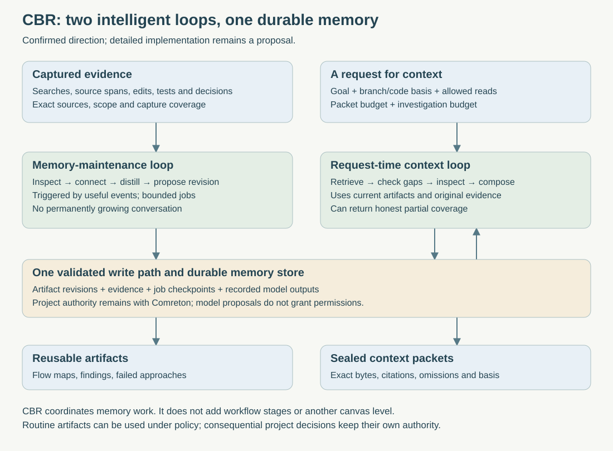

> Public edition `public-development-v1-20260913`. Adapted from the reviewed architecture baseline; names in the source may still say Comreton. See [publication and authority](https://github.com/Combraton/combraton/blob/main/docs/architecture/PUBLICATION.md). Development sequencing is governed by [DEVELOPMENT](https://github.com/Combraton/combraton/blob/main/docs/DEVELOPMENT.md); self-development is deferred until all four usable v0.1 releases.

# CBR's intelligent memory engine

> Accepted memory-engine architecture in [BASELINE](https://github.com/Combraton/combraton/blob/main/docs/architecture/BASELINE.md), 12 September 2026. SDK/model choices and numerical tuning follow implementation evaluation.

CBR is an active system for creating and maintaining useful understanding. Its model-assisted derivation is a central capability. It should help with individual code searches and tool outputs as well as long projects. A model need not run for every input, and it does not become the authority for project requirements.

Read [the public spec](SPEC.md), [versioned memory internals](INTERNALS.md), and [how the engine manages its own context and runtime](MODEL-RUNTIME.md). These chapters elaborate the same service; they do not add another controller or canvas level.



## 1. Two loops, one durable memory system

The **memory-maintenance loop** receives a bounded job: investigate a useful discovery, distill a completed exploration, connect a result to an existing artifact, or refresh knowledge after a relevant change. It can inspect allowed evidence, follow unresolved references, propose an explanation, and revise memory through the validated commit API.

The **request-time context loop** receives an actual question, target view, permissions, latency/cost budget and receiving harness constraints. It retrieves reusable material, checks applicability, investigates material gaps when authorized, and composes a cited packet. Useful new findings return through the same memory write path. Packet delivery does not depend on completing all pending maintenance.

Both loops use the same scoped evidence, artifact identities, typed proposals, revision checks and retention rules. “Loop” means a bounded control procedure; it does not imply two permanently running model conversations, two models, or two new services.

CBR can coordinate its own read-only investigations and memory transformations. Comreton still decides project workflow readiness, permissions and acceptance. PIO remains an optional execution provider when CBR needs an existing harness. Standalone CBR can use a model provider directly without Comreton or PIO.

## 2. Artifacts, snapshots and packets are different

| Object | Purpose | Example |
|---|---|---|
| Memory artifact revision | Reusable, inspectable understanding with support and uncertainty | Explanation of the two tool-icon rendering paths |
| Memory snapshot/view | Select compatible revisions, decisions, scope and source coverage | The memory view for branch A at code R17 |
| Context packet | Material chosen and arranged for one request | What the next agent needs to fix the icon bug |

A snapshot is not every memory concatenated into one prompt. The same artifact can contribute differently to a bug-fix packet, a refactoring packet or a newcomer explanation. A new packet does not rewrite one already delivered.

## 3. From noisy exploration to a useful artifact

Using the user's screenshot as an illustrative investigation, a harness has searched files, read rendering code and compared two paths. CBR receives captured evidence at a particular checkout basis. It does not assume the screenshot alone verifies the current repository.

1. Identify the useful discovery: modal rendering and message-stream rendering use different paths.
2. Read the cited source spans, including relevant surrounding branches. Check what they actually support.
3. Separate source observations from a proposed causal explanation. Source inspection alone may not establish runtime behavior.
4. Draft a compact flow artifact with exact source revisions, an unresolved question and the verification still needed.
5. Link it to the issue/component and existing artifacts. Keep potentially conflicting explanations.
6. Commit the derivation and artifact revision, then track dependencies for later rechecking.

Illustrative artifact:

```text
Subject: inconsistent tool icon
Basis: captured checkout R17 (illustrative)

Observed in inspected source:
- Modal rendering calls getToolIcon().
- Message rendering uses eventToDisplayObject().
- The inspected message branch lacks the Bash-specific override.

Interpretation:
This difference could explain the inconsistent icon.

Unresolved:
Whether a later runtime branch changes the icon.

Next verification:
Render the same Bash event through both paths.

Support:
Exact file revisions and source ranges, with fetch references.
```

This is usable derived context without requiring a human to approve every sentence. Policy labels its reliance and uncertainty. Accepting a project requirement or certifying a consequential outcome remains a separate authority operation.

## 4. Small artifacts are a first-class use case

| Input that consumes context | Useful output | Essential qualification |
|---|---|---|
| Many search results | Relevant files/symbols and unresolved search directions | Record search scope; incomplete search does not prove absence |
| A code investigation | Flow, conditions and source references | Track dynamic behavior not established by inspection |
| A sequence of edits | Change rationale, resulting revision and remaining work | The artifact describes changes; it does not execute them |
| Test/build logs | Named failures, decisive excerpts, run identity and full-log reference | Preserve runner errors, skipped checks and incomplete capture |
| Large JSON output | Task-relevant fields, selected paths and source reference | Mark omitted content; do not silently change values or units |
| A rejected approach | Reason, evidence and scope of rejection | A local failure does not become a universal prohibition |

Some outputs can be parsed deterministically. Use models for the interpretation, connections and explanation that benefit from them. No schema should force every artifact into triples; prose, diagrams and structured fields can coexist.

## 5. Context prevention and later compaction

When CBR owns a tool boundary, store the full permitted payload first and return a bounded projection plus fetch references. This can prevent the main harness from ingesting all the noise. For exploratory work, CBR can investigate in a separate bounded job and return the resulting artifact.

Where the coding harness's integration does not expose that boundary, CBR cannot retroactively remove tokens already delivered. It can still provide explicit context tools, handoff artifacts and fresh-session packets at supported boundaries. Native compaction control must be verified per adapter.

Compaction produces a new representation of captured work. It does not erase raw sources by default, establish truth, or change current project policy. A smaller representation can omit an important relationship; the engine must keep coverage and deeper retrieval available.

## 6. Persistent work without constant model calls

Triggers include explicit requests, completed investigations, meaningful edits, failed checks, handoffs, corrections, and material gaps found while preparing a packet. Batch related events and avoid launching a model for every token or log line.

Every job has a source/view basis, question, permission scope, priority, resource budget, progress record and finish condition. Foreground context requests take priority over optional maintenance under bounded scheduling. Jobs can checkpoint and continue later; they do not hold one growing model conversation forever.

Repeated work is deduplicated by source revisions, job purpose and relevant configuration. A newer event makes an older result historical, not automatically current. Commit-time revision checks prevent a delayed worker from overwriting a later correction. Unfinished maintenance and incomplete source coverage remain visible.

### Memory supports steering without becoming project authority

The [shared steering view](https://github.com/Combraton/combraton/blob/main/docs/architecture/STEERING.md) uses these artifacts to connect intended behavior, observed paths, evidence gaps and meaningful changes. Routine bounded investigation and repair of memory artifacts can proceed under the existing grant. A suspected mismatch stays a hypothesis until supported; incomplete instrumentation limits localization. CBR does not pause project execution or adopt new direction on the strength of a derived summary. Refresh relevant context without blocking all work on the maintenance backlog, and distinguish packet delivery from observed use by a harness.

## 7. What is confirmed and what remains to test

**Confirmed direction from the user:** model-assisted memory derivation is central; CBR should actively prepare useful artifacts and packets, including small everyday discoveries; its work remains within the existing Comreton/PIO/CBR boundaries.

**Accepted architecture:** two bounded loops, read-only investigative tools, durable task state, source-linked artifacts, deterministic commit/permission checks, and explicit uncertainty. These do not require a trained memory model or a million-token window.

**Still to select:** SDK, supported model/provider matrix, numerical context limits, trigger thresholds, investigation depth and provider fallback policy. [MODEL-RUNTIME](MODEL-RUNTIME.md) fixes responsibilities while [BASELINE](https://github.com/Combraton/combraton/blob/main/docs/architecture/BASELINE.md) assigns component-selection milestones.

Compare this approach with disciplined repository notes, simple lexical retrieval and direct model calls. Measure repeated exploration avoided, preservation of constraints, incorrect conclusions delivered, citation support, human reconstruction time, latency and total maintenance cost. A cleaner-looking packet alone is not success.

## 8. Source basis

[HumanLayer's context-engineering write-up](https://github.com/humanlayer/advanced-context-engineering-for-coding-agents/blob/main/ace-fca.md#what-exactly-are-we-compacting) provides practitioner examples of research/plan/progress artifacts and also reports failed or incorrect investigations. It motivates this artifact-oriented workflow; it is not a controlled benchmark of CBR. The prior [research map (historical; not included)](https://github.com/Combraton/combraton/blob/main/docs/architecture/PUBLICATION.md#historical-material) distinguishes other papers and their evaluation limits.

## 9. Preparation and consolidation policy

Background “dreaming” is bounded maintenance, not another service or always-running model. Coalesce compatible events and refresh useful artifacts while protecting active context needs. Make committed binding corrections addressable before semantic consolidation. Greenfield capture starts with small decisions/findings; brownfield work begins with bounded orientation and task-directed preparation, then deepens through actual work.

Use many artifact revisions and immutable memory views; a project index is navigation rather than one expanding summary. Context timing is selected by the caller and attached to observable boundaries. [PREPARATION-AND-DELIVERY](PREPARATION-AND-DELIVERY.md) is the detailed contract, including gaps, resource admission, deadlines and evaluation.
