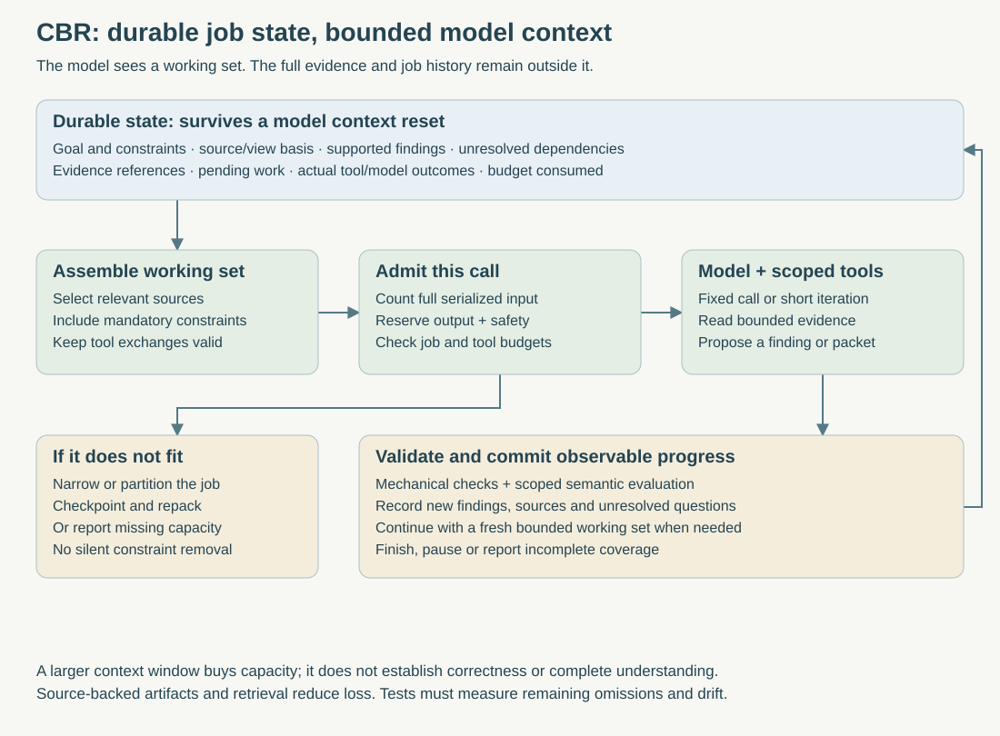

> Public edition `public-development-v1-20260913`. Adapted from the reviewed architecture baseline; names in the source may still say Comreton. See [publication and authority](https://github.com/Combraton/combraton/blob/main/docs/architecture/PUBLICATION.md). Development sequencing is governed by [DEVELOPMENT](https://github.com/Combraton/combraton/blob/main/docs/DEVELOPMENT.md); self-development is deferred until all four usable v0.1 releases.

# CBR's own context limits and model runtime

> Accepted bounded-runtime architecture in [BASELINE](https://github.com/Combraton/combraton/blob/main/docs/architecture/BASELINE.md). Library/model selection and tuning remain implementation tasks; no runtime has been implemented or benchmarked by this documentation.

**CBR's model has the same finite context and reasoning limitations as any other model.** We cannot promise that it never omits a dependency or produces a mistaken packet. The architecture should bound each call, preserve recoverable evidence and expose uncertainty when the task exceeds its capabilities. A million-token model is optional capacity, not a requirement or correctness mechanism.



## 1. Separate durable knowledge from the model's working context

The durable store contains evidence, artifact revisions, decisions, job records and exact model/tool outcomes under retention policy. Each model call receives only a bounded working set for its current question.

A memory job's checkpoint records its goal, pinned project/code basis, constraints, relevant artifact IDs, inspected evidence IDs/ranges, findings with support, competing hypotheses, unresolved dependencies, pending work and consumed budget. Mechanically known fields come from the runtime, not a model's recollection. Explanatory fields remain model-authored derivations with provenance.

Do not persist or depend on hidden model reasoning. Record observable actions, explicit findings and the evidence needed to justify them. After interruption, rebuild working context from this checkpoint and source references. A new model call continues the job; it need not remember the old transcript.

This avoids an infinite regress of memory agents summarizing other memory agents. Storage, counters, cursor positions, revision checks and scheduling are ordinary software. Models perform bounded semantic tasks within that structure.

## 2. Admit every call against a real budget

Budget the fully serialized request, including system instructions, tool schemas, messages, retrieved excerpts, tool outputs and provider-specific image/message overhead. Reserve output/reasoning allowance according to the provider's accounting, plus a safety margin. Do not count shared provider allowances twice.

```text
serialized input + reserved generation + safety margin
    <= effective permitted context capacity
```

The effective capacity uses tested provider/model limits and local policy. A separately evaluated quality target may keep working context smaller than the advertised maximum. There is no universal safe utilization percentage or assumption that all small models reason equally well.

The following table budgets one internal CBR model call. The receiving harness supplies a separate packet-size constraint.

Illustrative combined capacity of 32,000 tokens:

| Allocation | Tokens |
|---|---:|
| Instructions, tool schemas and job contract | 4,000 |
| Checkpoint, constraints and selected findings | 4,000 |
| Focused source evidence | 12,000 |
| Recent required tool exchanges | 4,000 |
| Reserved generation | 4,000 |
| Safety margin | 4,000 |

These values explain the accounting; they are not defaults or a claim that 32k is sufficient for every task. Use compatible tokenization or provider counts where available, calibrated estimates otherwise. Recheck before every provider call, including after tool batches and before a summarization call.

CBR's internal call budget and the receiving harness's packet budget are separate. Producing a packet can require several calls, each bounded, while the delivered packet may be much smaller. Price, latency, call count and context capacity have separate limits. Optional background spending must be visible and configurable.

If required instructions/evidence do not fit, partition, narrow the task, use an authorized alternative, or return a typed insufficient-capacity/coverage result. Never silently omit mandatory constraints. A provider overflow caused by a bad estimate triggers a bounded repack/retry with recorded failure; it does not restart unlimited investigation.

## 3. Bound tools before their outputs enter context

The memory tool surface is deliberately small: search permitted evidence, read a bounded span, inspect artifact revisions, compare scoped code snapshots, list dependencies, propose a memory patch and produce a packet candidate. All operations recheck authorization in CBR. Tool payloads remain untrusted data.

Search is paginated. File reads have span and byte/token bounds. Large logs/JSON are stored with digest/coverage, then projected into relevant fields or excerpts with continuation references. A tool batch has an aggregate response budget; ten individually bounded outputs can still overflow the next call. Spill to durable storage and return handles when needed. Preserve valid tool-call/result pairs when pruning messages.

Plain source parsing is deterministic where feasible. Model-assisted extraction receives bounded source batches and records what it actually inspected. File splits should respect functions, sections or other useful boundaries where possible; unresolved cross-boundary references remain work items.

Arbitrary shell execution, unrestricted network access, coding-agent instruction discovery and repository writes are not default memory tools. A controlled execution provider can supply separately authorized verification when needed. A memory tool allowlist is not an OS sandbox; protect the host/provider boundary accordingly.

## 4. Finish or checkpoint before context is exhausted

A simple known transformation can finish in one call. An investigation can use several turns: select a source, inspect it, update findings, then decide what remains unresolved. The runtime checks budgets and progress between turns.

When the working set becomes crowded, commit small supported findings, checkpoint the remaining job, and construct a fresh call from relevant durable records. The continuation uses selected evidence, not a repeatedly compressed copy of the entire past conversation. Never invoke a summarizer with an input that already exceeds its own capacity.

Partition work around questions or dependency groups. For a rendering bug, one job might map the modal path, another the message path, and a comparison job inspect their evidence-backed findings and connecting source. This can run sequentially; the architecture does not require a swarm.

Partitioning can miss interactions. Preserve cross-group references, disagreements and uninspected dependencies in a durable investigation frontier. The synthesis job must fetch the relevant original evidence for pivotal cross-group conclusions. Exhausted budgets yield partial coverage or a blocked conclusion, not “whole repository understood.”

Termination comes from code-enforced step/call/byte/cost limits and a declared finish condition, not merely the model saying it is done. Cancellation and restarts retain outstanding jobs and captured results. A repeated tool read should not cause endless self-triggered consolidation.

## 5. Protect packet quality without claiming a truth oracle

Use distinct checks:

- **Mechanical:** correct scope, source identity, citations that resolve to exact ranges, current selected revisions, required constraints represented, size bounds and declared omissions.
- **Semantic:** whether the source actually supports the explanation, important contrary evidence is represented, and the packet answers the request. A model can help review this, but that review remains fallible.
- **Task outcome:** whether a receiving harness preserves constraints and completes better work using the packet. Only evaluation establishes this benefit.

A valid citation can still support a wrong inference. A second model reading the same summary is not independent corroboration. Important claims should be checked against original evidence and suitable tests/observations; preserve “not established” when those are unavailable.

Re-summarizing summaries can compound loss. Treat them as navigation aids and derived explanations, while keeping their source dependencies available. Consolidation creates new revisions without silently erasing rejected paths or promoting repeated opinions to facts. Material requirement conflicts remain explicit until resolved by the bound authority.

For cheap or local models, permit narrower jobs, more targeted retrieval and fewer semantic commitments. A larger model can be offered under explicit provider/privacy/cost policy, but never assumed. No supported model should be marketed as capable of every task simply because it fits the schema. Without an available qualified model, deterministic retrieval/export can degrade honestly while intelligent synthesis is unavailable.

## 6. Runtime architecture: direct calls plus a lightweight memory harness

| Choice | Good fit | Cost or limitation |
|---|---|---|
| Direct model calls through a provider abstraction | Known extraction, small artifact revision, bounded comparison or rendering | Poor fit when the next evidence read depends on the previous answer |
| Lightweight tool-using runtime with CBR-owned policy | Investigation, stale-artifact refresh, request-time gap filling | Requires controlled tools, checkpoints, budgeting and adapter tests |
| Full coding-agent SDK | Fast experiment or delegated code investigation | Brings session, tool, resource-discovery and compaction policies that need explicit isolation/configuration |
| Fork a full coding harness | Only if a concrete unsupported requirement demands it | Ongoing merge, security and upstream-maintenance burden |

**Accepted responsibility:** CBR owns a small memory-specific harness: its job lifecycle, working-set policy, tools, checkpoint format, validation and commit authority. Reuse a maintained provider abstraction and, if it passes the requirements, a lightweight agent runtime for model/tool iteration. Use direct calls for fixed jobs. Avoid making one indefinite coding-agent conversation the memory system.

This keeps two notions distinct: reusing an SDK is a library decision; owning the memory loop is an architectural responsibility. A framework's automatic compaction is a useful mechanism, not CBR's canonical memory model.

### Pi as a concrete candidate

On 12 September, the original `badlogic/pi-mono` repository endpoint resolved to `earendil-works/pi`; the inspected revision is [71dca871bc80b6bc97be37f0ca3189399d651fff](https://github.com/earendil-works/pi/tree/71dca871bc80b6bc97be37f0ca3189399d651fff). Package names and behavior below refer to that source snapshot, not an installed release.

The [agent-core documentation](https://github.com/earendil-works/pi/blob/71dca871bc80b6bc97be37f0ca3189399d651fff/packages/agent/README.md) describes tool execution, event streaming, context transformation, tool hooks and a stop-after-turn hook. These are relevant control points for a CBR-owned working-set policy. A per-tool termination hint is not a substitute for a job-wide budget barrier.

The [coding SDK](https://github.com/earendil-works/pi/blob/71dca871bc80b6bc97be37f0ca3189399d651fff/packages/coding-agent/docs/sdk.md) includes session/resource lifecycle, with default resource discovery. The [compaction design](https://github.com/earendil-works/pi/blob/71dca871bc80b6bc97be37f0ca3189399d651fff/packages/coding-agent/docs/compaction.md) describes summarization while retaining session records. The [root documentation](https://github.com/earendil-works/pi/blob/71dca871bc80b6bc97be37f0ca3189399d651fff/README.md#permissions--containerization) explicitly places permission isolation outside Pi's built-in behavior. CBR must supply its own scope and enforcement boundaries.

The inspected lower layers are `@earendil-works/pi-agent-core` and `@earendil-works/pi-ai`. Their TypeScript runtime would be an explicit packaging choice alongside the currently proposed Rust CBR core: either a bounded worker bridge or a separately agreed language decision. A Rust-native provider adapter with a small loop is also reasonable. This document does not introduce a hidden Node dependency or select an SDK release. [The repository license](https://github.com/earendil-works/pi/blob/71dca871bc80b6bc97be37f0ca3189399d651fff/LICENSE) was inspected; dependency/release compatibility still needs validation.

Before selection, test pre-call context control, aggregate tool limits, cancellation, error/usage fidelity, model fallback policy, resource-discovery isolation, exact output capture and restart without duplicate commits. SDK state is an execution aid; CBR's journal remains the authority. No SDK has been installed or executed in this pass.

## 7. Evaluation before promises

Test smaller and larger supported context capacities against the same tasks: repeated resets, large logs/JSON, distant code dependencies, conflicting branches, stale sources, missing evidence, a misleading prior summary, interrupted checkpointing and model/provider errors. Measure accepted task outcomes, missing critical constraints, unsupported claims, repeated reads, latency and total cost across all internal calls.

Include direct-call, simple lexical and disciplined-notes baselines. Run a long sequence of continuations to detect cumulative drift. Predefine required facts and withheld traps for fixtures, then test real tasks separately; fixture success alone is not field reliability. The engine should fail visibly when it lacks capacity or evidence, and should earn any added investigation cost through better downstream work.

## 8. Optional programmatic workers and source reuse

CBR may use a constrained programmatic worker to batch search, join code relationships, parse large results and return small evidence-backed projections. Begin with deterministic tools and fixed calls; use adaptive investigation when the next read depends on findings. Add generated programs or limited child calls only where measured value justifies them. Neither code execution nor recursion is mandatory for a context request.

The host enforces filesystem/network/effect scope, CPU, memory, elapsed time, output and total model-call limits. Child calls share the parent investigation budget; depth limits alone do not bound breadth. The host records actual source reads, programs, results, omissions and child status. Model-authored citations cannot substitute for observed provenance. Authoritative memory writes go through CBR's validated commit API.

A persistent Python heap is a disposable execution aid with a different lifetime from durable evidence/job records. Best-effort snapshots may skip values. Resume from retained records or report a gap; do not load arbitrary serialized worker state into a privileged host or assume SDK compaction is canonical memory.

Prime is a separately distributed fork of upstream Pi; retained package names do not make their releases interchangeable. Pin the actual repository and release artifact during selection. The [Prime source assessment (historical; not included)](https://github.com/Combraton/combraton/blob/main/docs/architecture/PUBLICATION.md#historical-material) examined commit `66658d2cf73153340f23133fbc16eafac31423e8`: CPython/JSON-lines kernel, bounded projections, host-owned child lifecycle and best-effort snapshots. Its Python environment explicitly is not an OS sandbox. These mechanisms are reuse candidates; the full coding runtime, inherited package names and release artifacts are not selected dependencies.

A narrow component experiment must compare direct/native tools, a lightweight library and any selected kernel bridge against context control, interruption, aggregate accounting, provenance, permission isolation and restart fixtures. Prefer the smallest dependency satisfying those contracts. CBR retains the memory job lifecycle, working-set policy, budgets and commit authority regardless of library.

Procedure/prompt improvements are separate versioned proposals with evaluation and adoption authority. Publishing a memory artifact does not authorize self-modification of permissions, trust policy, acceptance rules or selected project direction. Scheduling and timely delivery remain governed by [PREPARATION-AND-DELIVERY](PREPARATION-AND-DELIVERY.md).
