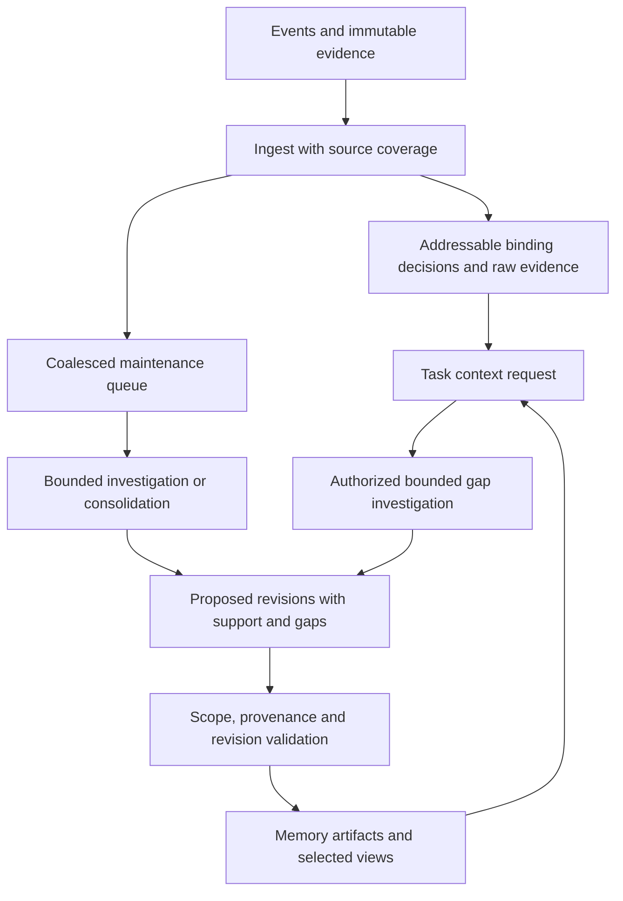
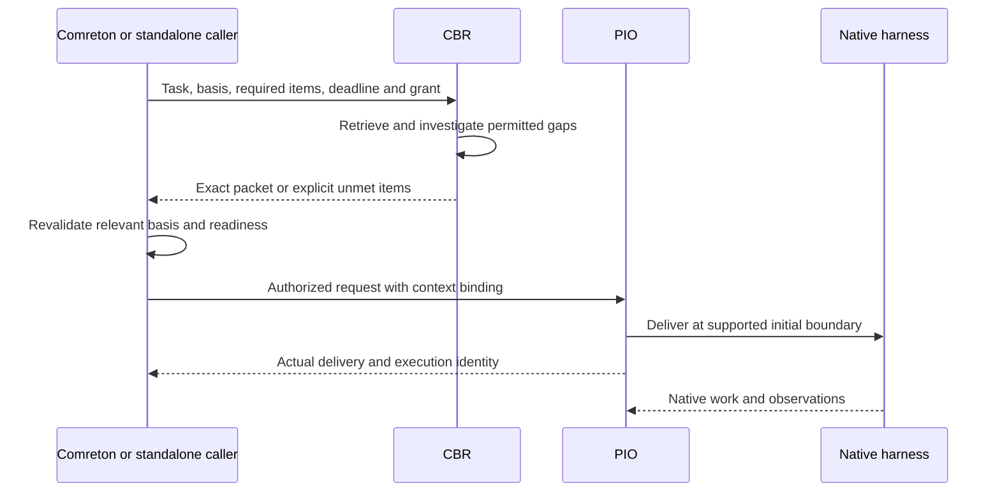

> Public edition `public-development-v1-20260913`. Adapted from the reviewed architecture baseline; names in the source may still say Comreton. See [publication and authority](https://github.com/Combraton/combraton/blob/main/docs/architecture/PUBLICATION.md). Development sequencing is governed by [DEVELOPMENT](https://github.com/Combraton/combraton/blob/main/docs/DEVELOPMENT.md); self-development is deferred until all four usable v0.1 releases.

# CBR preparation, assimilation and timely context

> Accepted behavior in [architecture-v1-20260912](https://github.com/Combraton/combraton/blob/main/docs/architecture/BASELINE.md). This chapter owns the detailed preparation/readiness semantics; the protocol maps them into interoperable contracts. Wire names and numerical defaults are selected through the build milestones. Research rationale remains in the [dated assessment (historical; not included)](https://github.com/Combraton/combraton/blob/main/docs/architecture/PUBLICATION.md#historical-material).

## 1. The problem and the promise

Useful memory must be accurate enough for its intended reliance, scoped to the actual code/environment, small enough to use, and available at a boundary where work can act on it. A correct explanation arriving after an irreversible action did not prevent that action. A fast summary for another branch is not useful current context.

CBR prepares reusable understanding ahead of demand and investigates gaps when a real question needs it. The promise is **amortized investigation**, not understanding a project once forever. Initialization, refresh and failed preparation all count toward cost. A one-off bug may be cheaper to investigate directly; related tasks may reuse a focused flow artifact many times.

## 2. Background consolidation is an existing memory procedure

“Dreaming” names bounded maintenance jobs: distill an exploration, connect related evidence, retain why an approach failed, refresh affected artifacts, identify contradictions, or prepare likely near-term context. It is not a third service, an immortal conversation or a model that must think continuously.

Once Comreton or the standalone authority commits a binding correction, it must be available on the next governed context/admission path without waiting for a model to rewrite memory. The controller can supply its exact authoritative reference/content directly while CBR's event ingestion catches up. CBR records the included authority revision and coverage; it cannot claim to have observed an event it has not received. If the binding content cannot be obtained, the relevant required condition remains unmet. Explanatory artifacts can be refreshed later.

Prioritize active context needs and material invalidations, then preparation for selected near-term work, then optional broader consolidation. Protect foreground capacity through bounded background admission or reserved capacity; a model call already in flight is not assumed instantly preemptible. The exact scheduling algorithm and limits require evaluation.

Coalesce by source basis, scope and purpose. Twenty lines from one test failure should not become twenty model jobs. Derived outputs must not trigger an endless self-summary cycle. Share investigation only across compatible access, branch, source and question scopes. Track subscribers separately: canceling one request must not cancel work still needed by another; service-wide budget revocation can still terminate it explicitly.

A job reports added, superseded, merged and unresolved material. Supersession changes selection while retaining history under retention policy. Repeated claims with shared lineage are not independent evidence. Optional background work can be deferred without losing durable inputs.

## 3. Greenfield and brownfield preparation

Start greenfield capture immediately with outcomes, constraints, decisions/reasons, rejected approaches, repository/environment identity and useful findings. Deepen artifacts as actual work provides evidence. Small code can still have complex requirements; project age does not prove understanding or capture completeness.

Brownfield assimilation is progressive and task-directed:

| Layer | Work and output | Admission behavior |
|---|---|---|
| Orientation | Bounded inventory of repositories, manifests, languages, documented entry points and visible tests; map with gaps | No default project-wide wait |
| Task preparation | Follow the flow, constraints and interfaces relevant to the requested change | Wait only at a selected required boundary |
| Incremental deepening | Revise touched areas using real investigations, edits and observations | Alongside authorized work |
| Optional broad assimilation | Explore likely future areas under a separate effort budget | No universal startup barrier |

Use deterministic readers/parsers where feasible. Surface unsupported languages, generated/vendored areas and parse failures. Documentation and static relationships are source evidence, not runtime proof. Reading source is distinct from importing modules, running scripts/tests or accessing services; those effects require their own grant. A mixed project can use different preparation depth for different subsystems.

Example: to fix duplicate survey ingestion, orient around the ingest entry point and retry configuration, inspect the relevant uniqueness constraint, preserve one failed approach and its reason, and mark concurrent-delivery behavior unknown until exercised. There is no need to summarize unrelated billing or frontend code first.

## 4. Three caller-selected context obligations

Comreton selects context requirements for its workflows. A standalone caller selects them for its own work. CBR reports available material and gaps; PIO enforces the authorized execution binding. Neither CBR nor PIO invents mandatory project knowledge.

| Obligation | Meaning | Missing material |
|---|---|---|
| Advisory | Helpful context; explicitly tolerates stated gaps | Authorized work can proceed with partial context or without enrichment |
| Required before a named transition | Bounded required items for a handoff, adoption or controlled effect | Hold that transition; authorized discovery/repair and independent work continue |
| Required before attempt start | Bounded required items for the initial brief | Do not admit that attempt as ready; separately authorized discovery may run |

Timing and reliance are independent. An advisory packet can contain a binding decision that still governs any work relying on it. “Advisory” describes whether this enrichment must arrive before the named action; it does not waive known constraints or make selected direction optional. Conversely, requiring receipt of a document does not prove its claims or establish comprehension.

Requirements name content obligations, sources/authority and evaluation rules. “Understand the entire repository” is not a checkable readiness condition. A structural check can establish that an exact selected constraint is included; it cannot certify the model internalized it. A required factual proposition may need separate verification beyond context delivery.

Deadline expiry returns an explicit unmet/partial result. It never counts a missing item as supplied, waives a required check or creates consent. Depending on existing authority, the caller can admit discovery, narrow work, wait, or request the actual missing decision. Retries and preparation have finite effort/deadline budgets.

## 5. Prepare before scarce execution admission

Do not hold a scarce harness slot or exclusive workspace writer solely while waiting for context that may need the same resource. Preparation has its own job identity, grant and resource accounting. Only ready work acquires its execution reservation. This does not make all advisory enrichment a startup dependency.

If CBR uses an existing harness through PIO, it submits an independently authorized investigation and records the returned execution identity. That memory job is not a fake Comreton workflow node. Direct model calls and deterministic preparation work without PIO. Where a stable read snapshot cannot be obtained, report that limit or schedule bounded access explicitly; do not pretend a changing checkout was immutable.

The caller's validation and PIO's dispatch are not one distributed transaction. Pin the accepted basis and authority/permission epochs; use the existing mediated authorization, revocation and reconciliation contracts at governed effects. Record later changes and delivered steering. Do not claim instantaneous revocation of an already-issued opaque action.

## 6. Contract meanings to freeze in Phase 1

The Context profile and its Execution binding must express:

| Meaning | Required interpretation |
|---|---|
| Request, task and consumer | Preparation identity before execution exists; eventual attempt/execution binding when admitted |
| Required items and reliance | Distinct obligations and binding/evidence/hypothesis/reference labels; authority that selected them |
| Target basis | Relevant repository trees, dirty snapshots, environment/configuration/build identities; multi-repository manifest where needed |
| Coverage | Per-producer observation frontiers, inspected source ranges and known gaps; no fictional global cursor |
| Timing/wait behavior | Advisory, before named transition or before start; exact boundary and authorized fallback |
| Resource constraints | Deadline, internal investigation grant/cost and output packet capacity are separate limits |
| Result identity | Immutable packet bytes/digest, selected artifact revisions, compiler/job provenance and inclusion/omission report |
| Applicability | Relevant dependency invalidation, expiry where justified, unresolved required items and reason |
| Delivery observations | Queued, delivered/acknowledged, unavailable or unknown under actual adapter capabilities; not behavioral proof |

These meanings are accepted; exact field names and error enums must be frozen with conformance fixtures before clients depend on them. Unsupported required timing or delivery semantics are rejected explicitly. Optional advisory enrichment can degrade only according to the caller's declared fallback.

## 7. Freshness and updates during work

Revalidate relevant dependencies immediately before the governed admission/action, using the controller's validation basis and effect authorization. A commit alone omits dirty files and environment changes. A recent timestamp does not rescue an artifact for the wrong branch. An older selected decision can remain binding.

If relevant inputs change during preparation, preserve the result as historical and rebuild, amend or refuse present reliance within the remaining budget. Avoid restarting for unrelated churn where tracked dependencies justify reuse. Unknown dependency coverage needs a conservative scope, not optimistic freshness.

Running attempts receive new findings as immutable versioned deltas at supported adapter boundaries. Retain the initial packet and each update's basis/delivery result. Advisory updates need not interrupt a productive loop. Binding changes go through Comreton's steering, mediated revocation or interruption when necessary; CBR itself cannot stop the project. Unsupported delivery remains explicit and the caller chooses a supported continuation/restart route within policy.

Native harnesses do not expose a hook before every hidden reasoning step. Timing guarantees apply to observable boundaries: initial prompt, explicit context request, supported turn steering or controlled effect. A packet arriving after the dependent action is recorded as late, even if it later helps repair.

## 8. Artifacts, memory views and exact packets

Maintain many small artifact revisions: selected architecture, one code flow, a test observation, rejected approach or unresolved investigation. A project index is navigation, not one giant mutable source of truth.

An immutable memory view selects compatible artifact/claim revisions and source coverage. It is distinct from Comreton's ProjectRevision and an execution checkpoint. For example: tree T8, decision D12, flow F6, PIO frontier 9814, CBR frontier 401, runtime evidence absent. That is a declared view, not a simultaneous world snapshot.

A packet selects the exact bounded material for one request. Show support/applicability labels such as declared requirement, source inspected, runtime observed, inferred, stale or unknown. Uncalibrated model confidence is not a substitute for these facts or authority to select a gate. Independent review must retain access to original evidence rather than only shared summaries.

## 9. Required failure fixtures and evaluation

| Counterexample | Required result |
|---|---|
| Human correction arrives during consolidation | Older derivation cannot replace selected correction; next governed path uses current binding or reports missing content |
| Packet arrives after dependent action | Preserve timing; do not claim prevention |
| Required context absent at deadline | Named condition remains unmet; authorized discovery remains possible |
| Preparation needs waiting consumer's slot | No reservation cycle; separate preparation/admission |
| Source changes or capture has gaps | Targeted invalidation or explicit uncertainty, not confident whole-project understanding |
| Shared incorrect artifact repeated by agents | Common lineage remains visible; repetition is not corroboration |
| Worker loses Python heap/SDK state | Resume from durable records or report lost evidence; no invented recovery |
| Background budget exhausted | Defer optional work; preserve input events and show cost |
| One of several requesters cancels | Detach its interest without silently canceling remaining authorized consumers |

Compare disciplined native work, basic retrieval, request-time investigation, added background preparation, and optional programmatic investigation with the same access, models, scope and outcome rubric. Include cold initialization and refresh costs. Measure accepted results, regressions, missed constraints, unsupported claims, first-useful-work latency, timely delivery, repeated exploration, foreground/background spend and human reconstruction effort. Background preparation and generated code must earn their costs; the architecture does not assume universal benefit.
