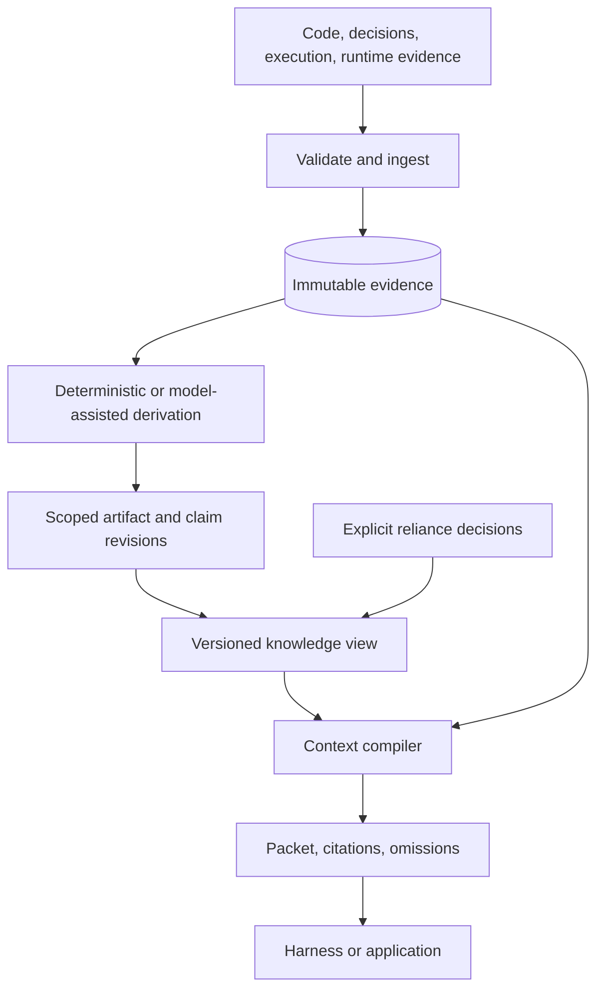
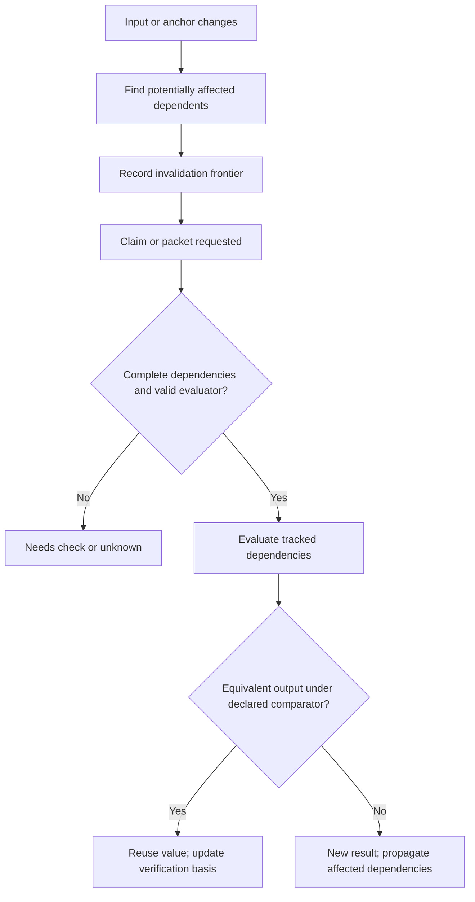

> Public edition `public-development-v1-20260913`. Adapted from the reviewed architecture baseline; names in the source may still say Comreton. See [publication and authority](https://github.com/Combraton/combraton/blob/main/docs/architecture/PUBLICATION.md). Development sequencing is governed by [DEVELOPMENT](https://github.com/Combraton/combraton/blob/main/docs/DEVELOPMENT.md); self-development is deferred until all four usable v0.1 releases.

# CBR: independent evidence, knowledge, and context

> Accepted fresh-build architecture in [BASELINE](https://github.com/Combraton/combraton/blob/main/docs/architecture/BASELINE.md). CBR preserves a useful, challengeable project model; storing or hashing prose cannot prove arbitrary claims.

The [internal design](INTERNALS.md) refines the memory write/build/read paths, typed patches, recorded model derivations, branch-safe context and exact packet history. The [intelligent memory engine](MEMORY-ENGINE.md) makes active maintenance and request-time investigation first-class capabilities. The [bounded model runtime](MODEL-RUNTIME.md) bounds CBR's own context, tools and jobs without requiring a million-token model. These preserve this public boundary and the single CBR storage authority.

## 1. What CBR does

CBR ingests observations, preserves their provenance, derives proposed claims, evaluates applicability, and compiles bounded context. It can run without PIO or Comreton. A developer can connect a harness or CI system directly and obtain cited context and historical knowledge without adopting a workflow canvas.

Model-assisted derivation is a central product capability, confirmed in the September knowledge-transfer review. CBR organizes bounded memory jobs and can investigate permitted evidence to create useful artifacts, from individual code-flow discoveries to session continuity. It does not rely on one permanently growing model conversation. Specific runtime libraries and numerical budgets are implementation selections in [BASELINE](https://github.com/Combraton/combraton/blob/main/docs/architecture/BASELINE.md).

It is not transcript search with an “accepted” flag. Raw conversations are one input among code observations, decisions, diffs, tests, screenshots, traces, and runtime/environment records.

## 2. Internal architecture

| Module | Responsibility |
|---|---|
| Ingestion gateway | Authenticate producer, validate schema/scope, deduplicate, seal payload |
| Evidence store | Immutable descriptors/payloads, origin and capture coverage |
| Claim and provenance store | Stable lineage plus immutable revisions, typed dependencies and conflicts |
| Evaluation engine | Applicability, missing support, conservative change impact, policy eligibility |
| Context compiler and request loop | Task-specific retrieval, bounded gap investigation, applicability, packet budgets and provenance-preserving rendering |
| Authority adapter | Observe Comreton decisions or issue local standalone decisions under explicit binding |
| Memory job scheduler and maintenance loop | Event-driven investigation, extraction, artifact revision and index refresh; bounded priority, triggers and finish conditions |
| Model runtime and working-set manager | Fixed calls or controlled tool iterations, per-call context admission, bounded tools, durable checkpoints and explicit degradation |
| Retention manager | Dependency holds, branch roots, collection, tombstones, proof-loss reporting |

Search/vector/code indexes are replaceable accelerators. They do not own canonical evidence. Losing an index can reduce search coverage; it must not erase accepted history.

## 3. Evidence ingestion and derivation

Each producer submits an envelope with source identity, scope, capture time, code/build/environment anchors where relevant, content digest, media type, and completeness. CBR verifies bytes and declared permissions before committing the descriptor. Large payloads use a staged upload and seal operation.

Deterministic imports preserve narrow facts: “process X exited with code 0” or “test report T contains 81 passes.” A model extractor may propose “the authentication flow is correct,” but that is a new interpretation requiring support and evaluation.

Model calls happen outside deterministic reducers. Record the prompt/configuration identity, input manifests, model/provider identity when known, output, cost coverage, and derivation version. Replaying this result uses the recorded output; it does not call the model again.

Direct calls handle known transformations; bounded tool-using jobs handle investigations whose next read depends on prior findings. Both use one validated commit path. Artifact publication under configured policy is distinct from project acceptance: an appropriately labeled interpretation may help a harness without a new human approval for each sentence. Derived text cannot change binding requirements or permissions by itself.

Raw source material is data. Extracted instructions do not become project policy. A human can explicitly adopt a selected statement through an authority operation. This prevents persistent memory from silently accumulating permissions or behavioral rules.

## 4. Knowledge has planes and multiple kinds of state

Preserve normative decisions, observations, and interpretations separately, as defined in [MODEL](https://github.com/Combraton/combraton/blob/main/docs/architecture/MODEL.md). Do not force all content into subject-predicate triples: a design artifact can contain prose and diagrams with structured claims attached where they matter.

| Dimension | Example | Why separate |
|---|---|---|
| Reliance | proposed, accepted-for-use, rejected, superseded | Historical authority decision |
| Applicability | applicable, needs_check, invalid_for_target, unknown | Current relation to a target snapshot |
| Subject health | healthy, degraded, failing, unknown, not_applicable | What a runtime observation reports |
| Evidence availability | complete, partial, unavailable, purged | Whether supporting bytes can still be inspected |

A materialized status cache is allowed when it names the source revision and can be rebuilt. The real rule is “facts and evaluations own meaning,” not “never store a status column.”

## 5. Incremental evaluation without false certainty

Borrow the separation between scheduling work and determining whether it needs recomputation from [Build Systems à la Carte](https://www.microsoft.com/en-us/research/publication/build-systems-a-la-carte/). CBR maintains a durable dependency graph with changed/verified revisions for suitable deterministic derivations. A changed input marks candidate dependents; recomputation is demand-driven and bounded.

Salsa's [backdating code](https://github.com/salsa-rs/salsa/blob/65604afad5ff1036d2b883444d60c698bf531079/src/function/backdate.rs#L15) checks equality and other conditions; its diagnostics explicitly warn about untracked reads. We borrow that discipline. We do not infer that an unchanged sentence or source span proves an unchanged runtime claim.

For code-local syntactic claims, a versioned parser/comparator may establish equivalence. For behavior claims, include dependencies, configuration, build, environment, and relevant runtime observations. Generic whitespace normalization is unsafe for indentation-sensitive languages, strings, generated code, and comments used by tools. Preserve raw digests and identify any normalized representation and comparator version.

Incomplete call-graph coverage, dynamic loading, changed permissions, expired runtime observations, and unknown environment state all prevent an unjustified “applicable” result. An unavailable input does not compare equal to an old input. A human challenge can force reevaluation without rewriting evidence.

Salsa is an optional evaluator implementation, not CBR's durable database. Start with an understandable persistent dependency evaluator and optimize behind equivalence fixtures. Cyclic claim support cannot justify itself: reject unsupported cycles as proof, or expose the unresolved strongly connected component. Explicit fixed-point algorithms are a separately typed derivation class.

## 6. Conflict detection and authority

Candidate conflicts must share relevant subject identity, predicate semantics, scope, and time/environment coverage. Semantically similar strings across unrelated subjects are not enough. Deterministic incompatibility checks run before model-assisted suggestions.

A model may open a candidate conflict and suggest a distinguishing probe. It cannot delete the older claim or choose a winner. Store a conflict record and preserve competing values in the selected slot. Desired/observed drift is represented separately.

An acceptance policy names evidence classes and authority. Human acceptance may rely on judgment; deterministic acceptance may rely on specified receipts. Repeated agreement by agents is not automatically independent evidence. “N consistent observations” is insufficient without an actual independence and scope rule.

In full Comreton, CBR returns an eligibility/evidence bundle and observes the controller's reliance decision. Standalone CBR uses the same contract through a local authority binding. Neither mode lets a transformation own acceptance merely because it produced the claim.

### Evidence for ongoing human steering

CBR supplies versioned flow findings, meaningful changes, expected/observed comparisons and unresolved evidence gaps to the [shared steering view](https://github.com/Combraton/combraton/blob/main/docs/architecture/STEERING.md). It reuses the existing claim/artifact model; Comreton retains selected direction and decision authority. An exact divergence location requires adequate observations. With missing traces, report a bounded gap or hypothesis rather than inventing causality.

A model-assisted conflict candidate can inform an investigation without automatically blocking a project. Comreton evaluates whether recorded findings affect a selected transition condition. Routine scoped derivation, diagnosis and context refresh do not need human approval per finding. Refresh relevant packets without requiring every active harness to consume every update or wait for all maintenance. Packet delivery does not prove that a harness understood or followed the decision; later execution/evidence must support that claim.

## 7. Context compiler

A request specifies task intent, target view, exact work binding, read scope, budget, modality support, mandatory constraints, and allowable uncertainty. Compilation has a deterministic outer structure, even when retrieval ranking uses learned components.

1. Resolve the permitted project/session/branch view and relevant anchors.
2. Include non-negotiable scoped constraints and selected input contracts first.
3. Retrieve candidate evidence and claims by identity, lexical search, code relationships, time, and optional embeddings.
4. Filter by authorization, applicability, scope, conflicts, and duplication before ranking.
5. Select tiers: reference, short explanation, focused excerpt, full artifact where appropriate.
6. Fit the budget while reserving space for the task and tool interaction. If mandatory constraints cannot fit, return `budget_insufficient`; do not silently drop them.
7. Produce exact immutable bytes plus citations, target basis, estimates, omissions, and a fetch interface for permitted deeper evidence.

Packets label binding instructions, supported observations, hypotheses, and unknowns separately. Contradicting evidence travels with the selected claim when material. An excerpt includes omission markers and source identity rather than pretending to be a complete document.

Stable bytes improve reproducibility and may help provider prompt caching; this is measured per adapter. Capture timestamps live in metadata unless semantically needed in the content. A recall ledger is keyed by native context generation and source revision. Reset it after compaction or restart when retention of prior content cannot be proved. Delivery does not prove the model still remembers the material.

The request loop may inspect original evidence and refresh a stale artifact under its granted scope and budget. It does not wait for all background maintenance. Internal call budgets are separate from the receiving harness's packet budget. Enforce limits before every model call, including tool-result and compaction calls; persist job state outside model context. If necessary source relationships remain unresolved, declare incomplete coverage rather than producing a falsely complete packet. See [context and runtime safeguards](MODEL-RUNTIME.md).

## 8. Native context and boundaries

PIO exposes actual harness boundary events. CBR derives at meaningful boundaries such as turn completion, handoff, compaction, pause, or explicit request. It does not assume every harness exposes identical hooks.

Current [Claude Code hooks](https://code.claude.com/docs/en/hooks#precompact) document pre/post-compaction behavior, including limitations when compaction is blocked. Adapter conformance must establish the installed behavior. A CBR maintenance backlog cannot indefinitely veto necessary native compaction; preserve the available boundary evidence and show incomplete harvest.

On continuation, decide between native resume, supported fork, or a fresh packet-based conversation. A “truth handshake” may ask the receiving harness to predict the relevant runtime path and identify uncertainty. This catches misunderstandings but is a diagnostic response, not proof of comprehension or permission to proceed outside policy.

## 9. Session, project, and global knowledge

Node evidence contributes to a versioned session record. Session records contribute to a project snapshot. Explicitly shareable lessons can contribute to a personal/global knowledge view. Each transformation retains sources, scope, privacy, and applicability; summary hierarchy cannot create authority.

Binding policy flows downward through explicit precedence and grants. Learned summaries flow upward as evidence or proposals. A project-specific workaround does not become a global rule by appearing in several summaries.

Maintenance has a named trigger, scope, budget, and finish condition. It can regenerate annotations and propose updates. It cannot mutate accepted decisions, erase failed approaches, or silently change active packets. Project/global promotion is an explicit policy operation.

Schedule work after meaningful discoveries, edits, failures or requests; batch related events rather than calling a model for every output line. Maintain reusable artifact revisions, selected snapshots and task-specific packets as distinct objects. During native-tool integration, bounded projections can prevent context flooding only where CBR controls the delivery boundary; later compaction cannot remove tokens already consumed. The [memory engine flow](MEMORY-ENGINE.md) covers both paths.

## 10. Retention and privacy

Trace reachability from current views, retained historical branches, pins, active packets, open gates, and unresolved effects. Leases help coordinate external references; reference counts alone are not deletion authority. Cycles with no roots must not leak forever.

Derived access is constrained by its supporting sources. Where alternative independent support exists, evaluate each support set; visibility is not blindly all-or-nothing across every source ever mentioned. Redaction requires a new artifact and an explicit authorized declassification step when necessary, not just removal of a citation.

CBR returns a proof-loss report for purge or unavailable payloads. Exact delivered packets need retention for faithful attempt inspection; they may reference additional source bytes whose retention is separately declared.

## 11. Standalone acceptance and evaluation

Standalone operations: ingest/seal evidence, propose/revise claim, record scoped reliance decision, evaluate applicability, compile/fetch context, inspect/compare history, pin/export/purge under authority. A script or CI caller can use them without a workflow node.

Evaluate extraction precision, citation correctness, stale-claim escape, false conflict rate, knowledge updates, temporal questions, abstention, context cost, and downstream task success. [LongMemEval](https://arxiv.org/abs/2410.10813) motivates several memory abilities, but conversational memory scores do not validate software architecture claims.

[Evaluating AGENTS.md](https://arxiv.org/abs/2602.11988v2) reports that context files did not generally improve success in its tested settings and increased average inference cost. Our inference: CBR must earn its context budget through task-specific experiments and ablations; comprehensive memory alone is not a benefit claim.

## 12. Preparation and timely context contract

[PREPARATION-AND-DELIVERY](PREPARATION-AND-DELIVERY.md) defines bounded background consolidation, immediate access to binding corrections, greenfield capture and progressive brownfield assimilation. These use the existing maintenance and request-time loops; no project-wide assimilation barrier or permanent model conversation is introduced.

The caller selects advisory, required-before-transition or required-before-start obligations. CBR returns the exact packet, applicable basis and explicit required gaps. It never silently downgrades required context on timeout. Keep deadline, internal investigation budget and output capacity distinct. Preparation must not hold its waiting consumer's scarce execution resources. Versioned updates preserve earlier packets and record actual delivery; unavailable hooks and late arrival remain visible.
